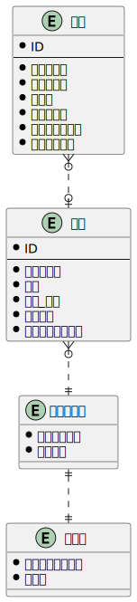

### 課題1

- 物理モデルと論理モデルの違い
  - 物理モデルは実装を考慮して作成するが、論理モデルは実装を考慮しない
  - 論理モデルを作成した段階ではDDLは作成できない。物理モデルからDDLを作成することができる。
    - 具体的に論理設計で決めることは
      - エンティティ
      - エンティティの属性、関係
    - 具体的に物理設計で決めることは
      - テーブル名やカラム名の物理名
      - テーブルの主キー、外部キー
      - カラムのデータ型
      - インデックス

### 課題2
- シャリの大小を選べるようにする
  - 注文詳細テーブルに「シャリサイズ」カラムを追加する
- セット商品含め、寿司ネタの売上個数把握できるようにする
  - セット_単品テーブルを新規作成。商品テーブルと関係を持たせることで売上個数を把握できるようにする

### 課題3
- 自分が考えた仕様
  - キャンペーンを開催するので、期間限定で特定の寿司ネタの金額を変更する
    - 回答
      1. 期間限定価格テーブルを作成
        - 商品ID、開始日、終了日、価格をカラムに持たせる
        - 価格を使用する際は、商品テーブルに期間限定価格テーブルを外部結合。紐づくデータがない場合は通常の価格を使用する。

- Irikawaさんの考えた仕様
  - 顧客が会員登録済みかを判定し、会員の場合は会計が5%オフになる
    - 回答
      1. 会員、会員ランク、割引率のテーブルを作成する
          - 会員のランクによって割引率が変更されることを想定して会員テーブルを作成しました。しばらくは普通会員1レコードだけ存在しているイメージです。
          - 会員のランクは割引率以外の判定にも使う可能性があるかなと思ったので、会員ランクと割引率のテーブルを分けました。
      1. 注文テーブルに会員コードカラムを追加する
          - 会員ではない場合Nullを格納する想定です。
      - 