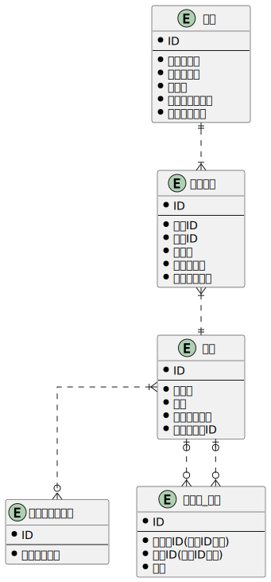

### 課題1

- 物理モデルと論理モデルの違い
  - 物理モデルは実装を考慮して作成するが、論理モデルは実装を考慮しない
  - 論理モデルを作成した段階ではDDLは作成できない。物理モデルからDDLを作成することができる。
    - 具体的に論理設計で決めることは
      - エンティティ
      - エンティティの属性、関係
    - 具体的に物理設計で決めることは
      - テーブル名やカラム名の物理名
      - テーブルの主キー、外部キー
      - カラムのデータ型
      - インデックス

### 課題2
- シャリの大小を選べるようにする
  - 注文詳細テーブルに「シャリサイズ」カラムを追加する
- セット商品含め、寿司ネタの売上個数把握できるようにする
  - セット_単品テーブルを新規作成。商品テーブルと多対多の関係をとることで売上個数を把握できるようにする

### 課題3
- キャンペーンを開催するので、期間限定で特定の寿司ネタの金額を変更する