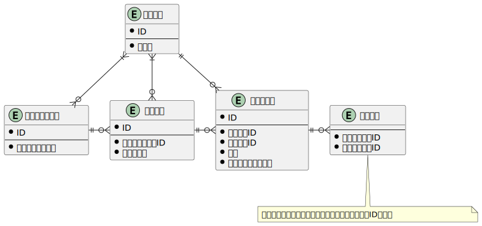

### 課題1

- 気になる点 不安点など
  - スレッドとメッセージの関係性
    - もっといい表現があるのではないか。
  - ワークスペースとユーザー、チャネルとユーザーの関係性
    - ワークスペースやチャネルに紐づくユーザーが0ということは考えられるか(仕様次第？)
  - DMをどう表現するか
    1. 新しくDMを表すエンティティを作成
        - ワークスペースID、ユーザーID①、ユーザーID②をカラムにもつ
        - メッセージエンティティにDM IDを追加。チャネルIDまたはDM IDを持つようにする
    1. メッセージエンティティに宛先ユーザーIDカラム追加
        - ユーザーIDと宛先ユーザーIDで絞り込んだメッセージをDMとする
        - DMでの投稿はチャネルID＝NULLでインサートする
    1. その他