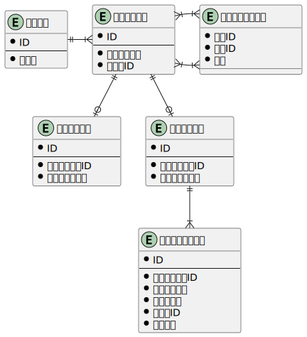

### 課題1


#### 考えたことなど
- ディレクトリやドキュメントの表現
  - ディレクトリの構造を柔軟に変更できることを考え、閉包テーブルモデルを採用しました。
  - オブジェクトテーブルは、「ツリーを構成する各ノード」のようなイメージです。
    - 経路テーブルで同等のエンティティとして扱いたいために抽象的なテーブルを1つ作成しました。
    - いい命名が思い付かず、名前も抽象的になってしまいました。
  - DBからデータを取得後、階層構造を整形しやすいために、親IDをオブジェクトテーブルに持たせました。

- 上記ER図には表現できていませんが、ユーザがワーススペースのような場所に所属していてて、ワークスペースとルートオブジェクトが紐付けられているようなことをイメージしてました。

### 課題2
  - オブジェクトテーブルに表示順カラムを追加する
    - 動かす対象と、動かした後の表示順をリクエストして、表示順カラムを更新していく
    - 同じ親IDを持つオブジェクト内で一意な順番をふる

  - 参考
    - AirTableの表示順更新時のリクエスト
  ```
    stringifiedObjectParams: {"rowIds":["recwYtREtZvJBYjdk"], "targetVisibleIndex":12}
    requestId: reqtM9wt9IDcL5HB3
    secretSocketId: socOjCWEOuH1bLkXA
  ```