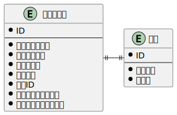

### 課題1

- 設定された情報から次回のリマインド実行日時を計算し、タスクのレコードを追加する
- 宛先チャネルには chat.postMessage の引数 channel として送信するものを格納する(チャネル宛のものや個人宛のもの)
  - https://api.slack.com/methods/chat.postMessage#channels
- 複数人宛に送信された場合は、その人数分レコードを追加する
- バッチ処理ではタスクテーブルを参照しに行き、起動時間 >= リマインド実行日時のデータに対してリマインドを送信する
- 送信したレコードは削除する
- 削除するタイミングで次の実行日時を計算し、新たにレコードを追加する
- タスクと頻度は別の概念なのかなと思い、テーブルを分けました

#### 考えたことなど
- タスクはイベントなのかリソースなのか
  - タスクのリマインドが設定されたという事実なのでイベント？
  - リマインドするタスク = what なのでリソース？
  - アプリケーションの使用方法的にリソースぽいけど作成日時を持たせた方がいいのかなという
- バッチでリマインドするタスクを判定するため、どのような形式で頻度のデータを持たせるべきか