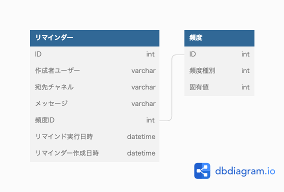

### 課題1

- ***リマインドテーブル***
  - リマインダーの初期設定時、またはバッチでのリマインド実行処理時に次回のリマインド実行日時を計算し、レコードを追加する
  - 完了したリマインドのレコードは削除する
  - バッチ処理ではリマインドテーブルを参照しに行き、起動時間 >= リマインド実行日時のデータに対してリマインドを送信する
  - 宛先チャネルには chat.postMessage の引数 channel として送信するものを格納する(チャネル宛のものや個人宛のもの)
    - https://api.slack.com/methods/chat.postMessage#channels
  - 複数人宛に設定された場合は、その人数分レコードを追加する
- ***頻度詳細***
  - リマインドを送信する頻度を表す
  - 頻度種別
    - 例)時、日、週、月
  - 値
    - 例)7, 3, 2
  - リマインドと頻度は別の概念なのかなと思いテーブルを分けた

#### 考えたことなど
- リマインドはイベントなのかリソースなのか
  - リマインドのリマインドが設定されたという事実なのでイベント？
  - リマインドするリマインド = what なのでリソース？
- バッチでリマインドするリマインドを判定するため、どのような形式で頻度のデータを持たせるべきか