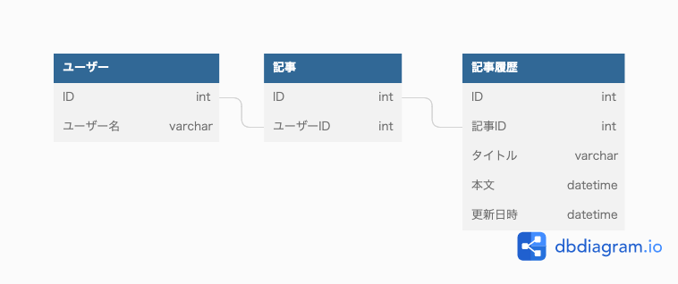
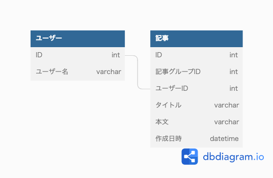

### 課題1

- ***記事テーブル***
  - 最新状態の記事を保存する
  - 記事一覧表示ではこのテーブルを参照
 

- ***記事履歴テーブル***
  - 最新状態の記事含め、記事の変更履歴を保存する
  - 記事履歴表示ではこのテーブルを参照

#### この設計にした理由
- 履歴を分けて管理した方がアプリケーションからの使用が楽になると考えたため
- 記事テーブルへのカラム追加があった際に履歴テーブルにも反映する手間が懸念されるが、記事に持たせる属性が頻繁に増えることはないのでは？と思った

#### 懸念点
  - 記事履歴テーブルのレコード量が増える
    - 本文のカラムサイズが大きく、更新頻度も高そう
  - 記事テーブルへカラム追加が発生した場合、記事履歴テーブルへも追加する必要がある。

### 課題2
#### 分析のみの用途でも履歴データをデータベースに保存しておく必要があるのか？
アプリケーションで使用するDBには保存せず、分析用のDBに保存する対応でいいのかなと思ってます。
(過去のメンターセッションでそのような話があり、なるほどと思った記憶があります)

#### 課題1とは異なる履歴データの表現

- ***記事テーブル***
  - 過去のデータを全て保存する
  - 特定の記事の最新はフラグで判断
  - 特定の記事と、その記事との関係を表すときは記事グループIDを使用する
    - 記事の更新のたびに、関係を表すレコードの更新を防ぐため
  - 記事の一覧表示は、記事グループIDごとの最新を取得
  - 記事の履歴表示では記事グループIDで絞り込む
 

- ***メリット***
  - 記事テーブルへのカラム追加が容易
  - ごみ箱などへ移動させる場合、1つのテーブルで管理していた方が楽
 

- ***デメリット***
  - レコード量が多くなる
  - 記事の一覧を取得するのにやや手間がかかる
  - 記事グループIDという表現がぱっとみわかりづらい？
