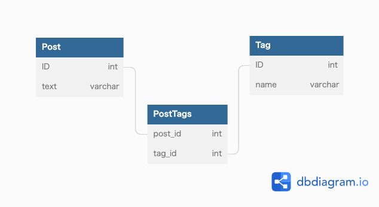

### 課題1
- タグの更新の手間が大きい
  - tagが1,2,3ある中でtag1を削除したい場合
    - tag2,3に入っていた値をそれぞれカラム1,2に更新してあげる必要がある
- タグに紐づく投稿を検索する場合に、tagのカラムを全て探しにいく必要がある
- タグの個数の上限が決まっている
  - 上限数を増やしたい場合に毎回カラム追加しなくてはいけない
  - 更新や検索をしている実装も修正を加える必要がある

#### アンチパターン本読んでの追記
- 値の一位性をDBで保証できない
  - tag1, tag2に同じ値が入る可能性がある

### 課題2

### 課題3
- メールサービス
  - メールを整理するために、メールテーブルに「ラベル」カラムを持っていた
  - メールに対して複数の「ラベル」を持たせたくなったため「ラベル2」、「ラベル3」と追加した