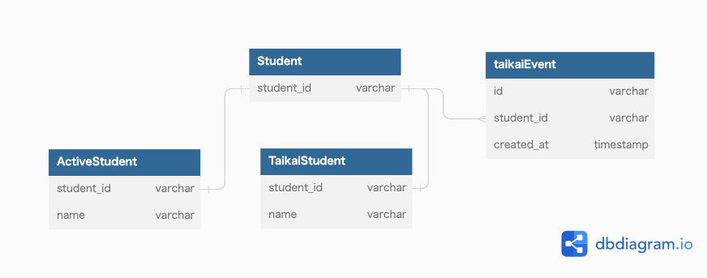

### 課題1
- taikaiFlag以外に、退会したという記録が残っていないとすると
  - 退会後再び入会した際に、退会経験があるかどうか区別がつかなくなってしまう
    - 例えば再度入会した人を対象にアンケートを取りたい。としても実現できない
- 様々なシーンでtaikaiFlagを見る必要がありそう
  - 面倒
  - 条件をつけ忘れてしまう可能性がある→バグにつながる
  - パフォーマンス的に問題が生じる？
    - https://www.slideshare.net/yoku0825/mysql-52276506/
- 休会を表現したくなった場合、StudentにkyuukaiFlagカラム追加されることになりそう
  - さらに見なくてはいけない条件が増える
  - statusカラムなどを用意しておくほうが拡張はしやすそう

### 課題2

- `taikaiEvent` を作成し退会のイベントを残しておくことで、退会経験に基づく機能の実装ができるようにする
- `Student` を共通の親テーブルとして持つ`activeStudent` と `taikaiStudent` を作成する
  - 生徒に対する詳細な情報は子供のテーブルに持たせる
    - 有効な会員であれば`activeStudent` と関連付けるだけでいいため、WHERE句での絞り込みが必要ない
  - 退会時に `activeStudent` から `taikaiStudent` にデータを移行する
    - 再度入会する場合は、`activeStudent` にデータを戻す
  - 生徒に関する情報は `Student` テーブルの `student_id` に対して関連付けを行う
- 懸念点
  - `activeStudent` と `taikaiStudent` どちらにもデータが入ってしまうことをDBの制約で防げない

### 課題3
#### 例)ECサイトでの注文（Order）を取り消す機能
- 取り消しをやめたい場合に実現できない
- ユーザーの取り消し回数など把握できない
  - 取り消しが多いユーザーに忠告したい場合など
- 取り消し理由を残すとすると、取り消した対象の注文も残しておきたい
#### 例)学習塾の進捗管理サービスで生徒（Student）の退会機能
- 再度入会した場合に以前の記録を引き継ぐことができない
- 外部キー制約を使用していたとすると、生徒に紐づくイベントの履歴も消えてしまう
  - どのコースが人気であるかや、コースの達成率などの情報は知りたい機会がありそう

#### 例)自身が過去に開発したサービスを振り返って、物理削除を採用したケース
- レンタル機材の予約サービス
  - 予約の取り消しを行う際は物理削除をしていた
    - ECサイトの例と同様だが、取り消しをやめたい場合に実現できない

### 参考
- https://www.slideshare.net/t_wada/ronsakucasual
- https://soudai.hatenablog.com/entry/2018/05/01/204442

---

### 「とりあえず削除フラグ」「論理削除　アンチパターン」などのワードの検索結果１ページ目の記事を全て読む

#### まとめ
- 何も考えなしにとりあえずで削除フラグを用意することがアンチパターン
- 仕様をきちんと把握すると、最適な設計は論理削除ではないかもしれない
  - 削除ではなく、別の状態であることが多そう
  - Q. 状態をどうモデリングすればいい？

#### 「とりあえず削除フラグ」
- [SQLアンチパターン 幻の第26章「とりあえず削除フラグ」](https://www.slideshare.net/t_wada/ronsakucasual)
  - デメリット
    - 常にWHERE句が必要、コードが削除フラグだらけ、認識の齟齬を生みやすい
    - コードレベルでデフォルトを変えたらバグがコロコロ
    - データ不整合と場当たり的クエリの巣窟 → (あまり意味わからず。。)
    - 「この表のデータ削除していいんだ」という暗黙の了解に思考を縛られる
  - まとめ
    - 「とりあえず」が思考停止
      - 全てのテーブルに削除フラグはおかしい
    - 「削除」は設計不足を示す
      - お客様は本当に「削除」と言っているか？
    - フラグ以外もある
      - 状態遷移で考える方がマシ
      - 更新/削除をしない世界もある
    - それでもよく考えた末での削除フラグならOK
- [「とりあえず論理削除」をやめる](https://qiita.com/kouki_o9/items/4dc3dc955fa9454d7aec)
  - デメリット
    - パフォーマンスに影響を及ぼす可能性がある
      - データ量の増大、それに伴うパフォーマンスの劣化(論理削除されているデータが多い場合)
    - バグを生み出す原因になる
      - WHERE句、 JOIN句への条件のつけ忘れ
    - 論理削除の「削除フラグ」は、「現在の状態」を表現するテーブルに過去の状態の一部を表現する機能を付与しているので複雑なテーブルになる
    - 更新、削除をせずに参照も少ないデータとして大量のデータが残ってしまう
- https://twitter.com/t_wada/status/580209622025310208
  - 思考停止した削除フラグがアンチパターン
- [【SQL】【DB設計】delete_flagについて調べたこと](https://zenn.dev/marimoofficial/articles/e8d6cc89d05d3e)
  - 引用がほとんど
- [とりあえず削除フラグ](https://scrapbox.io/gosyujin/%E3%81%A8%E3%82%8A%E3%81%82%E3%81%88%E3%81%9A%E5%89%8A%E9%99%A4%E3%83%95%E3%83%A9%E3%82%B0)
  - 引用がほとんど
- [削除フラグを検討し始めたときに見せたいスライド「論理削除をしない」](https://shinkufencer.hateblo.jp/entry/2019/01/29/215359)
  - 引用がほとんど
- [ITエンジニアの成長ブログ](https://mr-star.hatenablog.com/entry/RDB%E3%81%AE%E8%AB%96%E7%90%86%E5%89%8A%E9%99%A4%E3%81%AB%E3%81%A4%E3%81%84%E3%81%A6)
  - 論理削除のデメリット
    - データ抽出のSQLクエリに削除フラグの条件が必要になる
    - 論理削除すると、データがテーブルに残るのでディスクを圧迫する
    - 論理削除のカラムはカーディナリティが低いので、パフォーマンスが悪い
- [削除フラグっているの？いらないの？](https://www.go-next.co.jp/blog/server_network/25855/)
  - 引用がほとんど

### 引用されていた記事
- [論理削除が奪うもの](https://dekasasaki.tumblr.com/post/69487259373)
  - INSERTされるデータは事実。事実が消滅することは現実世界ではあり得ない。
  - アプリケーションは現実を何かの業務等々の観点で抽象化したもの。
    - それが扱うデータは事実に忠実にモデル化されたのなら残り続けているはず。
- [データの削除は非推奨](https://www.infoq.com/jp/news/2009/09/Do-Not-Delete-Data/)
  - IsDeletedフラグを使う代わりに、データの状態を表すフィールドを保持することを提案している。
- [論理削除フラグという名の死亡フラグ](https://ledsun.hatenablog.com/entry/2015/03/27/015203)
  - ユーザーから「論理削除」という言葉を聞いたことがない
    - 社員が退職（・転属）する、（売掛金の回収を諦めて）売上を打ち消す、「お知らせメッセージ」を公開日がくるまで非表示にする
    - もしかして「論理削除」は実装パターンではないか？
  - データ制約の弱さ
    - WHERE句での絞り込みが必要
    - UNIQUE制約がつけられない
      - 論理削除したレコードの、あるカラムと同等の値を持つレコードを追加したい場合、値は重複してしまうので制約がつけられない
  - 集合として認識できない
- [論理削除が云々について](https://mike-neck.hatenadiary.com/entry/2015/03/24/231422)
  - 「CRUD」の「U」と「D」はやめろ
- [DELETE_FLAG を付ける前に確認したいこと。](https://qiita.com/Jxck_/items/156d0a231c6968f2a474)
- [do-not-delete-softly](https://speakerdeck.com/moro/do-not-delete-softly)
  - 削除していない
  - 削除していないので削除と呼ぶべきでない
  - なぜ論理削除をするべきではないのか
    - データの終わりを設計できていない
    - 設計できてないのでやめ時が決められない
- [27. 論理削除とは何か？どのような解法があるのか？ w/ twada](https://fukabori.fm/episode/27)

- [PostgreSQLアンチパターン](https://www.slideshare.net/SoudaiSone/postgre-sql-54919575/)
  - 論理削除の理由
    - エンドユーザから見えなくしたいがデータは残したくない
    - 削除したデータを検索したい
    - データを消さずにログに残したい
    - 誤った操作を無かったことにしたい、直ぐに元に戻したい
  - デメリット
    - 積み重なる WHERE delete_flg = 0
      - テーブルごとにdelete_flg = 0の条件が必要になる
      - マテリアライズドビューで参照は改善されるが更新が手間になる
    - UNIQUE制約が使えなくなる
      - 削除フラグが0の場合にのみUNIQUE制約をつけることは可能
    - 複雑な表示条件の原因
  - テーブルに状態を持たせない
    - 例えば削除済みテーブルを作る
      - トリガーで移動させる
      - トリガーは仕様変更に弱いというデメリットがある
    - 関連したテーブルは必要なら削除ずみテーブルを作る、不要ならDELETEする
      - 外部キー制約が使えればCASCADEも出来る
- [PHPerに知ってほしいRDBの事 Version 2.0](https://speakerdeck.com/soudai/phpernizhi-tutehosiirdbfalseshi-sofalse2)
- [MySQLで論理削除と正しく付き合う方法](https://www.slideshare.net/yoku0825/mysql-52276506)
  - 余計なカラムは増えて欲しくない
  - 参照されないデータは入ってて欲しくない
  - テーブル設計的に汚い
