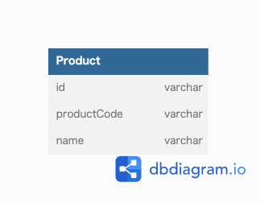

### 課題1
- 主キーに設定している商品コードが更新される可能性がある
  - 変更された場合、他のテーブルのレコードも変更する必要がある
    - 影響範囲を特定するのが面倒(ON UPDATE CASCADE をつければ大丈夫そう)
    - 不整合が起きる可能性がある(ON UPDATE CASCADE をつければ大丈夫そう)
    - 更新の負荷がかかる
- 商品コードが一意ではなくなる可能性がある
  - 商品コードと他のカラムによって一意とするように変更された場合
    - Productsテーブルの定義変更に加え、Productsテーブルを参照しているテーブルのFKも修正が必要
    - JOINやWHEREしている箇所の修正も必要になる
    - (複合主キーのデメリットかも？)

### 課題2

- 代理キーを用意して、主キーとする
  - 業務的な意味を持たないため、変更される可能性が少ない
- productCode を一意として保障したい場合はユニーク制約をつける

### 課題3
- 本の口コミをまとめているサービス
  - ISBNコードを主キーとして設計した場合にアンチパターンに陥る
- 業務的に一意であるとされているものに対して主キーを設定してしまうのはやめた方が良さげ

---
### 参考
- https://qiita.com/wanko5296/items/a96bdeccc250f7c18cee