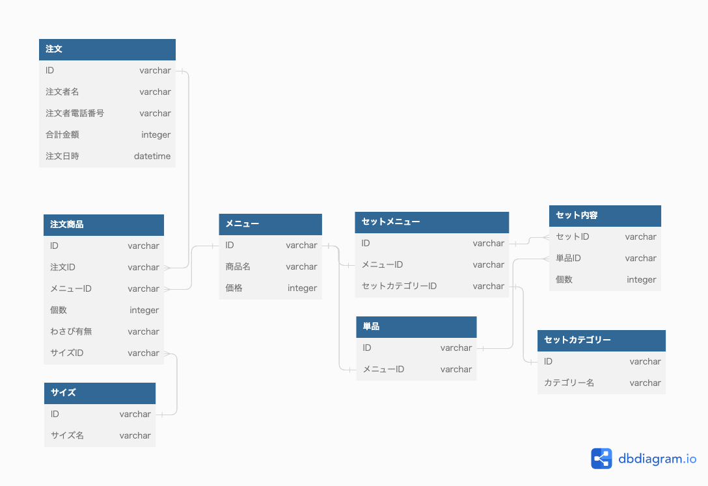

### 課題1
#### DBモデリング1

- 悩んだこと
  - しゃりサイズ、わさびの情報を商品に持たせるか、注文したときの情報に持たせるか
    - しゃりサイズやわさび有無に限らず、同一の商品として扱いたいケースが多そうなので注文情報に持たせた
      - メニューの表示単位、値段とか
  - お好み寿司とセットメニューのテーブルを分けるかどうか
    - セットメニュー特有のカテゴリー(?)のようなものがすでにあり、仕様上の差異が出てくることを考えて分けた

#### DBモデリング2

- 変更点なし
