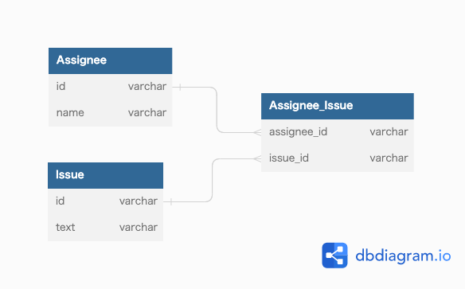

### 課題1
```
mysql> SELECT NULL = 0;
+----------+
| NULL = 0 |
+----------+
|     NULL |
+----------+
1 row in set (0.01 sec)

mysql> SELECT NULL = NULL;
+-------------+
| NULL = NULL |
+-------------+
|        NULL |
+-------------+
1 row in set (0.00 sec)

mysql> SELECT NULL <> NULL;
+--------------+
| NULL <> NULL |
+--------------+
|         NULL |
+--------------+
1 row in set (0.00 sec)

mysql> SELECT NULL AND TRUE;
+---------------+
| NULL AND TRUE |
+---------------+
|          NULL |
+---------------+
1 row in set (0.00 sec)

mysql> SELECT NULL AND FALSE;
+----------------+
| NULL AND FALSE |
+----------------+
|              0 |
+----------------+
1 row in set (0.00 sec)

mysql> SELECT NULL OR TRUE;
+--------------+
| NULL OR TRUE |
+--------------+
|            1 |
+--------------+
1 row in set (0.00 sec)

mysql> SELECT NULL IS NULL;
+--------------+
| NULL IS NULL |
+--------------+
|            1 |
+--------------+
1 row in set (0.00 sec)

mysql> SELECT NULL IS NOT NULL;
+------------------+
| NULL IS NOT NULL |
+------------------+
|                0 |
+------------------+
1 row in set (0.00 sec)
```

`SELECT NULL AND FALSE;`の結果はNULLだと思っていたが0だった

> 論理 AND すべてのオペランドがゼロ以外で非 NULL の場合は 1 に、1 つ以上のオペランドが 0 の場合は 0 に評価され、それ以外の場合は NULL が返されます。
<cite>[論理演算子](https://dev.mysql.com/doc/refman/8.0/ja/logical-operators.html)</cite>


### 課題2
#### テーブル設計見直し


#### NULLがデータベースに存在することは本当に悪いことなのでしょうか？

- 悪くはない
  - ただNULL値がたくさんあるテーブルは設計に問題があるかも
- NULLのデメリット
  - NULLが絡むSQLの評価がわかりづらい
  - アプリ側でNULL値の判定が必要になりコード量が増える
- NULLを避けられないケースはどんなとき？

### 課題3
- デフォルト値に設定した値が入っていた場合
  - それが不明であることを表すのか(NULLの代わりとして入っているものであるか)、値として意味があるものなのかがわからなくなる


### 課題4
- NULLと文字列を結合するとどう評価されるか
- 次の結果は何か　`SELECT 0 OR NULL;`