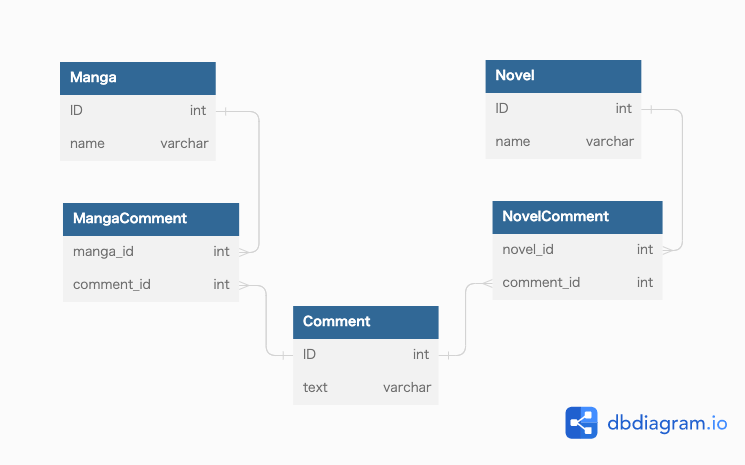
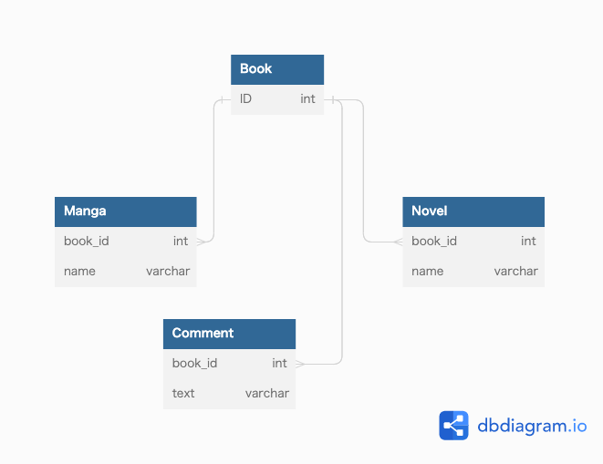

### 課題1
- Manga に対するコメントと Novel に対するコメントで仕様の差が出てきた場合
  - どちらか一方のtypeにしか必要ないカラムが出てくる
  - 必要のない方のtype(を持つレコード)にはNULLが入る
- 操作によるミスが起きる可能性が増える
  - belongs_to_idに外部キーを指定できない
  - それぞれ別のテーブルに対して結合してしまう可能性がある

### 課題2
#### 案1

- 1つの Comment レコードが、MangaComment と NovelComment のどちらとも紐づいてしまう可能性を制約で防ぐことはできない

#### 案2

- Mangaテーブル、 Novelテーブルのbook_idはbookテーブルのIDを参照
  - book_idは主キーでもあり外部キーでもある
- MangaとComment 、NovelとCommentは直接のリレーションシップはないがbook_idで結合が可能

### 課題3
- 動画投稿サービスを想定
  - 動画テーブルの他に、ショート動画が生まれる
  - コメントテーブルにbelongs_to_idカラムが生まれるとアンチパターンに陥る
