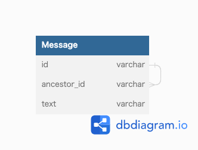

### 課題1
- 特定のノード配下のノード全てを取得するのが面倒
  - 子ノードのさらに子ノードと再起的に辿っていかなくてはいけない
    - 再起的に取得するクエリは標準ではない

### 課題2

- スレッドメッセージのような場合だと、親に加えてスレッドの起点となる祖先のIDを持たせることで解決できそう

- ツリー構造の表現方法には以下のようなものがある
  - 経路列挙
  - 入れ子集合
  - 閉包テーブル

### 課題3
- レッドマインのようなプロジェクト管理サービス
  - チケットがあり、さらにその子チケットが作れる場合
    - 親チケットのIDのみを持たせてた場合にアンチパターンに陥る