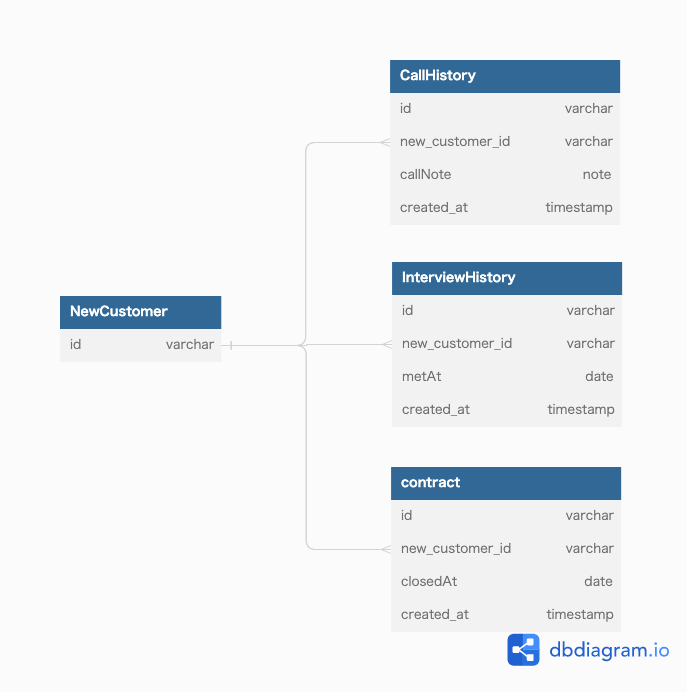

### 課題1
- 問題点
  - 面談、成約などのイベントにつき1回分の情報しか保持できない
    - 面談を3回実施して、1回目の面談日時を知りたい時
      - 3回目の日時しか知ることができない
    - 一度成約した後に解約し、後にまた同じ人が成約した
      - これも最初制約したときの日時は保持できない
  - 複数回のイベントを保持するとするとカラム追加するか別テーブルを用意する必要が出てくる
    - カラムの追加で対応するとなると、持たせたい回数が増えるごとに都度改修が必要になる
    - 別テーブルに保持しようとすると、情報が1箇所にまとまってない状態になってしまう
  - イベントとリソースが一緒になっているのが良くない
    - https://scrapbox.io/kawasima/%E3%82%A4%E3%83%9F%E3%83%A5%E3%83%BC%E3%82%BF%E3%83%96%E3%83%AB%E3%83%87%E3%83%BC%E3%82%BF%E3%83%A2%E3%83%87%E3%83%AB


### 課題2

- NewCustomer からイベントを切り離す
- 電話をかけたか、面談したかなどの情報はイベントテーブルと結合することで判断する
  ```sql
  # 電話済みの新規顧客
  SELECT nc.id FROM NewCustomer nc JOIN CallHistory ch ON nc.id = ch.new_customer_id GROUP BY (nc.id)
  ```
  ```sql
  # まだ電話していない新規顧客
  SELECT nc.* FROM NewCustomer nc LEFT JOIN CallHistory ch ON nc.id = ch.new_customer_id WHERE nc.id IS NOT NULL
  ```
- 上記テーブルの他に面談予定テーブルなども作成されると考えられる


### 課題3
- 書籍の仕入れを管理するサービス
  - 書籍テーブルの中に搬入日カラムを持たせていた場合
    - 増刷があり複数の搬入日を持たせたくなった場合にアンチパターンになる