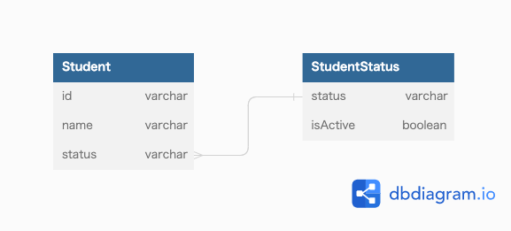

### 課題1
- statusに入る値を追加、削除、更新したい場合に、柔軟に対応できない
  - カラムに対して制約を再定義する必要がある
  - DBによってはテーブルが空でないと列定義を変更できない場合もある
  - テーブル定義のSQL流す間に不正なデータが入る可能性もあるかもしれない
  - 上記の理由から、サービスを1度止める必要があるかもしれない
- check制約で制限されている値のリストを取得するのに手間がかかる
  - メタデータ定義を取得する必要があり、クエリが複雑になることがある
  - (MySQLの場合)information_schemaに対してSELECTして結果を整形する必要があるとのこと
  - アプリケーションで値のリストを定義した場合、DBの値と同期しないと不整合が生じる

### 課題2


- `StudentStatus`テーブルを作成。そのテーブルに制限したい値を登録しておく
- `StudentStatus`テーブルの`status`カラムに対して外部キー制約を宣言することで`Student`テーブルの`status`カラムに入る値を制限する
- 制限された値のリストを取得するのが簡単
  ```sql
  SELECT status FROM StudentStatus;
  ```
- 追加時
  - `StudentStatus`にレコード追加する
- 削除時
  - `StudentStatus`の`isActive`カラムを`0`に更新する
  - `Student`の`status`は別の値に更新する
- 更新時
  - 外部キーに`ON UPDATE CASCADE`オプションを設定しておくことで`StudentStatus`の更新に合わせて`Student`も更新される

### 課題3
- ファッション関連を取り扱っているECサイト
  - メンズ服テーブルのサイズカラムに対して「S」「M」「L」「LL」「3L」をCHECK制約で指定していた
    - 海外展開することになり、取り扱うサイズを「XS」「S」「M」「L」「XL」に変更したくなった
