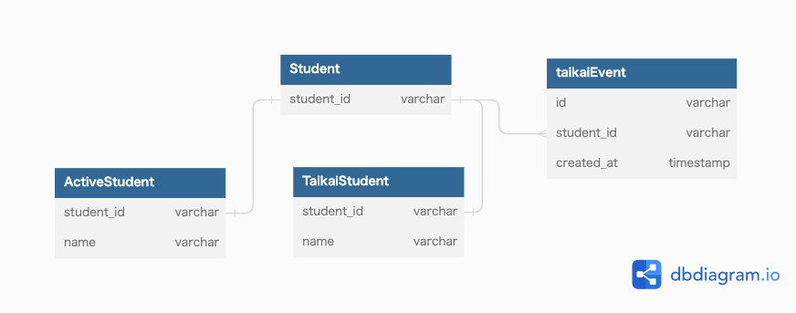

### 課題1
- taikaiFlag以外に、退会したという記録が残っていないとすると
  - 退会後再び入会した際に、退会経験があるかどうか区別がつかなくなってしまう
    - 例えば再度入会した人を対象にアンケートを取りたい。としても実現できない
- 様々なシーンでtaikaiFlagを見る必要がありそう
  - 面倒
  - 条件をつけ忘れてしまう可能性がある→バグにつながる
  - パフォーマンス的に問題が生じる？
    - https://www.slideshare.net/yoku0825/mysql-52276506/
- 休会を表現したくなった場合、StudentにkyuukaiFlagカラム追加されることになりそう
  - さらに見なくてはいけない条件が増える
  - statusカラムなどを用意しておくほうが拡張はしやすそう

### 課題2

- `taikaiEvent` を作成し退会のイベントを残しておくことで、退会経験に基づく機能の実装ができるようにする
- `Student` を共通の親テーブルとして持つ`activeStudent` と `taikaiStudent` を作成する
  - 生徒に対する詳細な情報は子供のテーブルに持たせる
    - 有効な会員であれば`activeStudent` と関連付けるだけでいいため、WHERE句での絞り込みが必要ない
  - 退会時に `activeStudent` から `taikaiStudent` にデータを移行する
    - 再度入会する場合は、`activeStudent` にデータを戻す
  - 生徒に関する情報は `Student` テーブルの `student_id` に対して関連付けを行う
- 懸念点
  - `activeStudent` と `taikaiStudent` どちらにもデータが入ってしまうことをDBの制約で防げない

### 課題3
#### 例)ECサイトでの注文（Order）を取り消す機能
- 取り消しをやめたい場合に実現できない
- ユーザーの取り消し回数など把握できない
  - 取り消しが多いユーザーに忠告したい場合など
- 取り消し理由を残すとすると、取り消した対象の注文も残しておきたい
#### 例)学習塾の進捗管理サービスで生徒（Student）の退会機能
- 再度入会した場合に以前の記録を引き継ぐことができない
- 外部キー制約を使用していたとすると、生徒に紐づくイベントの履歴も消えてしまう
  - どのコースが人気であるかや、コースの達成率などの情報は知りたい機会がありそう

#### 例)自身が過去に開発したサービスを振り返って、物理削除を採用したケース
- レンタル機材の予約サービス
  - 予約の取り消しを行う際は物理削除をしていた
    - ECサイトの例と同様だが、取り消しをやめたい場合に実現できない

### 参考
- https://www.slideshare.net/t_wada/ronsakucasual
- https://soudai.hatenablog.com/entry/2018/05/01/204442